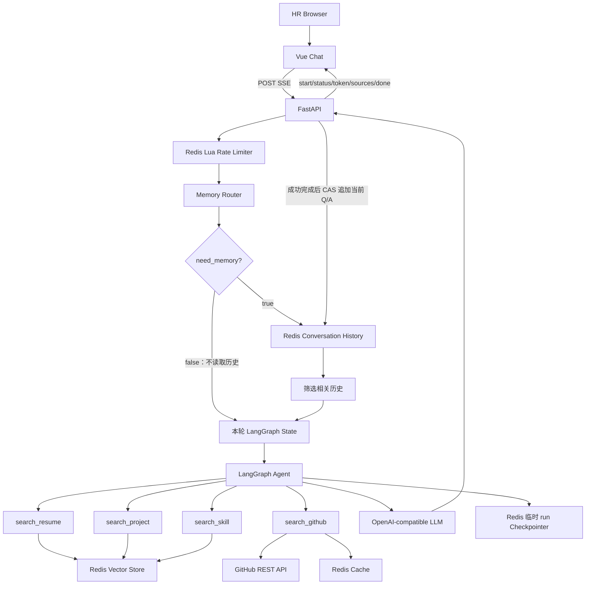
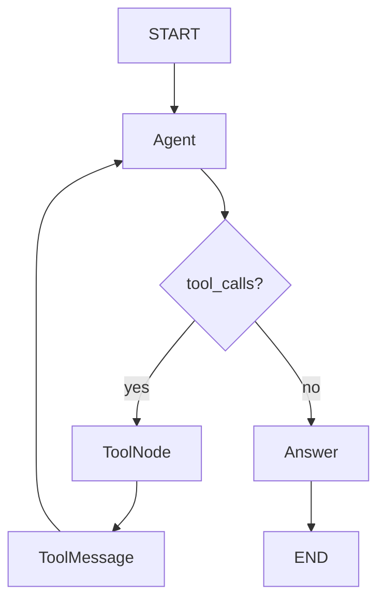
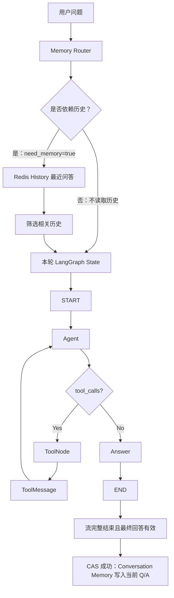

# Personal Interview AI Agent

一个可部署的个人技术面试助手。HR 或面试官通过唯一的聊天页面询问项目、实习、教育、技术栈和 GitHub 仓库；LangGraph Agent 按问题选择资料工具，基于 Markdown 知识库和 GitHub REST API 组织第一人称回答，并通过真实 SSE token 流返回浏览器。

项目将真实性放在首位：个人经历必须由工具数据支持；资料没有记录的 QPS、团队规模、职责或成果会明确回答“不知道”，不会按常见实践补全。

## 界面预览

项目提供响应式单页 Vue Chat UI。为了不把示例数据包装成真实求职材料，仓库暂不附带伪造聊天截图；部署并填入个人资料后，请按 [docs/screenshots/README.md](docs/screenshots/README.md) 添加自己的桌面端和移动端截图。

## 技术栈

- 前端：Vue 3、TypeScript、Vite、Composition API、Markdown It、DOMPurify、Fetch ReadableStream
- 后端：Python 3.12、FastAPI、Pydantic Settings、LangChain、LangGraph、httpx
- AI：OpenAI-compatible Chat API、DashScope Embedding
- 数据：Redis 8.4（Conversation Memory、Vector Search、LangGraph Checkpointer、Rate Limit、GitHub Cache）
- 部署：Docker、Docker Compose、Nginx

## 系统架构



## Agent Graph



图使用显式 `StateGraph(AgentState)`，其中 `AgentState` 扩展 `MessagesState`。`tools_condition` 判断 Agent 是否返回 `tool_calls`；有工具调用时由 `ToolNode` 执行，并将 `ToolMessage` 返回 Agent，继续本轮 ReAct / Tool Calling 循环；没有工具调用时进入独立 `answer` 节点生成最终回答，再到 END。

浏览器的 UUID `thread_id` 用于查找独立的 Conversation Memory。每个新请求都创建 `chat-run-<UUID>`，Redis Checkpointer 只保存这一次运行的 `HumanMessage / AIMessage / ToolMessage` 等临时执行状态，不恢复上一轮 checkpoint。“为什么在这个项目里用 Redis？”所需的项目语境由 Memory Router 判断后按需加载、筛选并注入；**不再每轮把完整历史自动发送给 LLM**。

## Tools

| Tool | 数据来源 | 适用问题 |
|---|---|---|
| `search_resume` | profile / education / experience / interview | 介绍、教育、实习、工作与职责 |
| `search_project` | project | 项目背景、架构、选型、难点、优化 |
| `search_skill` | skill | 候选人掌握程度、实际项目使用和解决的问题 |
| `search_github` | GitHub REST API | profile、公开仓库、语言、topics、README |

技能经验问题由 Prompt 引导 Agent 同时查询 skill 与 project；通用概念问题可直接使用模型知识，但不得把通用做法说成个人实践。GitHub 只在明确涉及仓库、README、开源项目时调用。

## RAG 与知识库

```text
Markdown Source of Truth
  → MarkdownHeaderTextSplitter (# / ## / ###)
  → RecursiveCharacterTextSplitter（仅对过长章节二次切分）
  → DashScope Embedding
  → Redis COSINE Vector Index
  → 统一 Retriever + category/project metadata filter
```

每个 chunk 带有相对路径 `source/path`、`category`、`title`、`project` 和 `section`，绝不保存服务器绝对路径。删除 Redis 后可从 Markdown 完整重建。当前资料已根据本地工程源码核验整理；参见 [knowledge/README.md](knowledge/README.md)。

## Redis 的五种用途

1. `langchain-redis` 向量索引：保存知识库 embedding，使用 COSINE 相似度及 TAG metadata filter。
2. Conversation Memory：独立 Redis List 保存成功完成的问答，默认保留 24 小时、最多 30 轮，按浏览器 `thread_id` 按需加载；提交指针使用相同 TTL。
3. `langgraph-checkpoint-redis`：保存每个独立 `chat-run-<UUID>` 的 ReAct 执行快照，默认 TTL 为 60 分钟。
4. Lua Sliding Window：原子限制同一 IP 任意连续 60 秒最多 5 个问题。
5. GitHub Cache：profile、仓库、languages 和 README 缓存 300–600 秒，降低 API 限额和延迟。

重新索引只执行 `FT.DROPINDEX <REDIS_INDEX_NAME> DD`，不会执行 `FLUSHALL` 或 `FLUSHDB`，其他 Redis 数据不受影响。

## 目录

```text
.
├── frontend/                 # Vue 单页聊天、SSE parser
├── backend/app/
│   ├── agent/                # Prompt、tools、StateGraph
│   ├── api/                  # health、POST SSE
│   ├── core/                 # config、Redis、IP、安全限流
│   ├── github/               # async GitHub client + cache
│   ├── rag/                  # loader、embedding、vector、retriever
│   ├── scripts/reindex.py
│   └── services/chat.py      # 安全的 LangGraph stream → UI events
├── backend/tests/
├── knowledge/                # 个人资料 Source of Truth
├── docker-compose.yml
└── .env.example
```

## 环境变量

复制 `.env.example` 为 `.env`。聊天与索引最少需要：

```env
LLM_API_KEY=你的模型服务密钥
LLM_BASE_URL=https://你的-openai-compatible-endpoint/v1
LLM_MODEL=支持 tool calling 的模型名
LLM_REASONING_EFFORT=
DASHSCOPE_API_KEY=你的-dashscope-key
EMBEDDING_MODEL=text-embedding-v3
REDIS_URL=redis://localhost:6379
```

可选配置：

```env
LOG_TIMEZONE=Asia/Shanghai
CHAT_HISTORY_TTL_MINUTES=1440
CHECKPOINT_TTL_MINUTES=60
GITHUB_USERNAME=公开 GitHub 用户名
GITHUB_TOKEN=可留空；配置后有更高 API 限额
GITHUB_CACHE_TTL=600
FRONTEND_ORIGIN=http://localhost:5173
TRUSTED_PROXIES=
RATE_LIMIT_MAX_REQUESTS=5
RATE_LIMIT_WINDOW_SECONDS=60
RATE_LIMIT_KEY_TTL_SECONDS=90
MAX_MESSAGE_LENGTH=2000
```

切换 DeepSeek、Qwen、OpenAI、OpenRouter 或其他兼容服务时主要调整 `LLM_BASE_URL`、`LLM_API_KEY`、`LLM_MODEL`，业务代码不变。所选模型必须支持 OpenAI-compatible tool calling 和 streaming。`LLM_REASONING_EFFORT` 默认留空；当模型的 Chat Completions 工具调用明确要求时再设置，例如 `gpt-5.6-sol` 需设为 `none`。

## 本地运行

要求 Python 3.12+、Node.js 22+ 和 Redis 8.4+。

```bash
cp .env .env

cd backend
python -m venv .venv
# Linux/macOS: source .venv/bin/activate
# Windows PowerShell: .venv\Scripts\Activate.ps1
pip install -e ".[dev]"
python -m app.scripts.reindex
uvicorn app.main:app --reload --port 8000
```

另开终端：

```bash
cd frontend
npm install
npm run dev
```

访问 `http://localhost:5173`；健康检查为 `http://localhost:8000/api/health`。缺少模型或 Embedding key 时，health 仍能检查 Redis，而聊天返回明确的 `CHAT_NOT_CONFIGURED` 503，不会产生神秘 500。

## Docker 运行

```bash
cp .env .env
# 填写模型、DashScope、GitHub 配置
docker compose up -d --build
docker compose exec backend python -m app.scripts.reindex
```

访问 `http://localhost:8080`。Compose 使用 `redis:8.4` 并开启 AOF volume。首次聊天前必须执行一次 reindex。

## 维护真实个人资料并重新索引

1. 阅读 [knowledge/README.md](knowledge/README.md)。
2. 在 `profile/`、`education/`、`experience/`、`projects/`、`skills/`、`interview/` 中新增或更新经过核验的 Markdown。
3. 检查分类、标题层级、事实依据与能力边界，确保 `knowledge/examples/` 保持为空。
4. 执行：

```bash
cd backend
python -m app.scripts.reindex
```

日志会显示读取文件数、chunks 数、旧索引状态、Embedding 和写入 vector 数；失败时给出原因。

## GitHub 配置

只查询公开资料时 `GITHUB_TOKEN` 可空。建议创建只读细粒度 token，并仅授予 Public repositories 的 Metadata/Contents 读取权限。Token 只进入 `httpx` Authorization header，永不进入工具返回、LLM context、source、前端或日志。README 最多截取 50,000 字符，且在 Prompt 中明确视为不可信数据。

## Rate Limit 与真实 IP

Redis key 使用 SHA-256 截断后的 IP 标识，TTL 仅略长于窗口，普通日志不记录完整 IP。Lua 在一次原子调用内完成：

```text
ZREMRANGEBYSCORE → ZCARD → 拒绝并算 retry_after
                         ↘ 或 ZADD + EXPIRE
```

第六次请求返回 HTTP 429、JSON `RATE_LIMIT_EXCEEDED` 和 `Retry-After` header。快速手测：

```bash
THREAD_ID=$(python -c "import uuid; print(uuid.uuid4())")
for i in 1 2 3 4 5 6; do
  curl -i -N -X POST http://localhost:8000/api/chat/stream \
    -H 'Content-Type: application/json' \
    -d "{\"message\":\"测试 $i\",\"thread_id\":\"$THREAD_ID\"}"
done
```

### Nginx / Cloudflare trusted proxy

应用默认只使用 TCP peer `request.client.host`，无条件忽略用户伪造的 `X-Forwarded-For`。只有 peer 落在 `TRUSTED_PROXIES` CIDR 时才解析代理 header。直接部署时保持为空；Nginx 与应用在受控 Docker 网络时配置该网络，例如：

```env
TRUSTED_PROXIES=172.16.0.0/12
```

生产环境应改为实际且尽量窄的 Nginx/负载均衡器地址或网段，不要照抄过宽公网段。Nginx 需设置 `X-Real-IP $remote_addr` 和 `X-Forwarded-For $proxy_add_x_forwarded_for`，SSE location 需 `proxy_buffering off`。Cloudflare 场景还应在防火墙层只允许 Cloudflare 回源，并把官方回源网段加入可信列表。

## 测试

```bash
cd backend
pytest
python -c "import app.main; print('backend import ok')"

cd ../frontend
npm test
npm run build

cd ..
docker compose config
```

测试不调用收费 Embedding 或真实 GitHub 网络，使用 fake/mocks 覆盖 Loader、metadata、Retriever filter、四个 Tools、GitHub HTTP、Lua 限流并发、输入校验、429、health 和 SSE。

## 建议面试问题

- “介绍一下你做过的项目。”
- “你 Redis 用得怎么样？在哪些项目中用过？”
- “刚才这个项目为什么选择 Redis？”
- “项目中最难定位的一次问题是什么？”
- “GitHub 上有哪些项目？某个仓库主要使用什么语言？”
- “这个项目峰值 QPS 是多少？”（资料没有记录时应拒绝编造）

## 常见问题

**health 显示 Redis unavailable**：确认 Redis 8.4 正在运行且 `REDIS_URL` 正确；响应不会包含 Redis 密码。

**聊天 503**：根据响应补齐 `LLM_API_KEY`、`LLM_MODEL`、`DASHSCOPE_API_KEY`，然后重启后端。

**检索不到刚修改的资料**：Markdown 是事实源，但不会自动写索引；重新运行 `python -m app.scripts.reindex`。

**模型不调用工具**：确认模型确实支持兼容的 function/tool calling；部分“OpenAI-compatible”服务只实现普通 chat completion。

**README 中的指令会不会被执行**：系统 Prompt 明确把知识库、README 和工具结果降权为不可信资料；仍建议不要把 Secret 写入任何知识库文件。

**如何创建 Redis Vector Index**：无需手写 schema。`reindex` 初始化 `RedisVectorStore` 并在首次写入时创建 `REDIS_INDEX_NAME`；metadata schema 与 COSINE 距离在 `backend/app/rag/vector_store.py` 中定义。


## 按需对话记忆与 TTL

### 跨轮历史与本轮状态

| 类型 | 数据与用途 | 生命周期 |
|---|---|---|
| Conversation Memory | `chat:history:{thread_id}` 独立保存跨轮历史，只包含成功完成的 User Question 和 Assistant Final Answer；按需加载 | 默认 24 小时，最多 30 轮 |
| LangGraph State / Checkpoint | 每次独立 `chat-run-<UUID>` 的本轮 ReAct 状态，含 `HumanMessage / AIMessage / ToolMessage` 和选中的 `memory_messages` | 临时状态，默认 TTL 60 分钟 |

Conversation Memory 不保存 `ToolMessage`、`tool_calls`、`intermediate`、`status`、`sources` 或 Agent 中间状态。临时 checkpoint 过期不影响仍在有效期内的跨轮问答。

### 完整执行流程



**不再每轮把完整历史自动发送给 LLM。** `need_memory=false` 时不读取 QA 历史；提交指针的读取仅用于 CAS，并不加载对话内容。本轮内部仍保留完整的 `Agent → ToolNode → ToolMessage → Agent → … → Answer` 循环。

每次 `/api/chat/stream` 请求先通过原有限流检查，再进入 `GraphChatService`：

1. 读取 `chat:committed:v1:<thread_id>`，仅作为并发提交版本，不恢复旧 checkpoint。
2. `MemoryRouter` 复用 Agent 的 ChatOpenAI，使用 `with_structured_output`（function calling、temperature=0）判断当前问题是否存在上下文依赖。独立问题返回 false；代词、省略、承接、比较对象缺失或引用“刚才/前面/上一个”返回 true。
3. 只有 true 才读取 `chat:history:<thread_id>` 最近 10 轮。第二次结构化判断选择最多 4 轮相关 QA；ID 去重、越界过滤并恢复时间顺序。空历史或无相关项不注入。每轮候选问题/答案最多使用 2000/6000 字符，存储仍保存完整最终问答。
4. 创建全新 `chat-run-<UUID>`。`messages` 只包含当前问题和本轮工具执行消息；筛选后的 QA 放在独立 `memory_messages` 字段，组装 Agent 与最终回答 prompt 时插入 system 与当前问题之间。保留 `agent → tools → agent → answer`、工具调用预算、planner 移除和 SourceItem 聚合。
5. 流完整结束、Graph 无待执行节点且产生非空最终 AI 回答后，通过同一 Lua 脚本进行提交指针 CAS 和 QA 追加。并发冲突只允许一个请求提交；模型错误、工具循环异常、未完成执行、取消、流提前关闭都不会进入提交步骤。Router/筛选错误也通过现有 error SSE 返回，不静默加载全部历史。

`MemoryService` 复用现有 async Redis 连接，不创建额外连接或引入依赖。普通记忆日志只包含 thread_id、判断结果和轮数，不记录对话正文。

### 两种独立 TTL

| Settings / 环境变量 | 默认值（分钟） | 作用数据 |
|---|---|---|
| `chat_history_ttl_minutes` / `CHAT_HISTORY_TTL_MINUTES` | 1440（86400 秒） | `chat:history:{thread_id}` 和 `chat:committed:v1:{thread_id}` |
| `checkpoint_ttl_minutes` / `CHECKPOINT_TTL_MINUTES` | 60（3600 秒） | Saver 内部按 `chat-run-<UUID>` 保存的 checkpoint、latest pointer、工具写入和 registry key |

`MemoryService` 必须注入聊天历史 TTL，并在内部统一以 `ttl_minutes * 60` 转换成秒，不再硬编码 24 小时。历史 List 每项 JSON **只有 `user` 和 `assistant`**；成功提交的同一 Lua 操作追加 QA、裁剪到最近 30 轮，并以相同的聊天历史 TTL 续期历史和提交指针。读取不续期，CAS 失败不写入、不续期。

`chat:committed:v1:{thread_id}` 的值仍是最后成功运行的 checkpoint 配置 JSON，仅作为并发提交版本使用，不用于恢复上一轮上下文。它可以比对应的临时 checkpoint 存活更久；这是两类数据的预期生命周期，不影响历史加载或 CAS。

Saver 使用[官方原生 TTL 配置](https://redis-developer.github.io/langgraph-redis/main/user_guide/ttl.html)：`ttl={"default_ttl": settings.checkpoint_ttl_minutes, "refresh_on_read": True}`，单位为分钟，由 Redis 自动过期，没有新增定时清理任务。保留读取续期行为，应用仅读取当前 run 的 checkpoint。将 `CHAT_HISTORY_TTL_MINUTES` 改为 720 后，历史及提交指针在下次成功提交时使用 43200 秒 TTL；修改 `CHECKPOINT_TTL_MINUTES` 只影响临时执行快照，不改变 Conversation History TTL。历史过期后，依赖上下文但无法确定对象的问题会请求用户澄清。

旧版本 checkpoint 中的对话不会自动迁移到 QA List，也不会再被注入新请求；新版本只积累成功完成的新问答。配置需重启后端生效；已有 key 保留原 TTL，直到对应的写入或续期发生，不会批量重设旧数据的过期时间。没有扫描或删除旧数据。部署前没有 TTL 的旧 checkpoint 仍需单独安排清理。

### 验证

```bash
redis-cli LRANGE "chat:history:<前端thread_id>" 0 -1
redis-cli TTL "chat:history:<前端thread_id>"
redis-cli GET "chat:committed:v1:<前端thread_id>"
redis-cli TTL "chat:committed:v1:<前端thread_id>"
# 从提交指针 JSON 取出 configurable.thread_id（chat-run-...），再查该 run 的 key。
redis-cli --scan --pattern "*<chat-run-UUID>*"
redis-cli TTL "<扫描得到的 checkpoint / checkpoint_latest / checkpoint_write / write_keys_zset key>"
```

默认配置下，成功回答后历史及提交指针 TTL 应接近 86400 秒，临时 run 的 Saver key TTL 应接近 3600 秒；再成功回答会续期历史及提交指针。失败请求不新增 QA。

```powershell
# 项目根目录；fakeredis 执行真实 Lua，Graph 测试使用 InMemorySaver，不访问真实 LLM。
backend/.venv/Scripts/python.exe -m pytest backend/tests -q -p no:cacheprovider
```

记忆测试覆盖默认及自定义 TTL 的启动注入、两类配置互不影响、历史和提交指针同步续期、读取不续期、30 轮上限、CAS 冲突和失败隔离，并使用真实 Graph/ToolNode 验证多轮工具调用、临时 thread 隔离、只保存最终 QA，以及仅 `need_memory=true` 时读取历史。Saver TTL 测试使用官方 `AsyncRedisSaver` 和 fakeredis，替换 fakeredis 不支持的搜索索引创建，实际执行 checkpoint、工具写入及 TTL 操作；不等同于真实 Redis 服务集成测试。模型分类、选择和回答使用测试替身，不访问真实 LLM。
