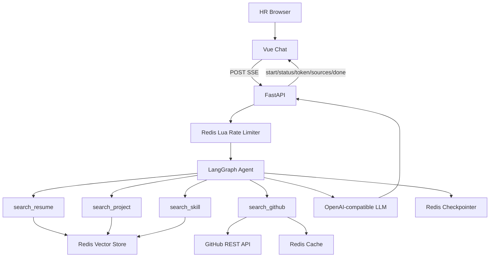
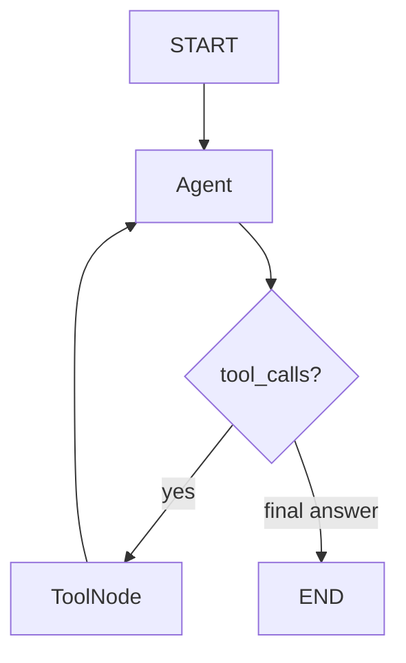

# Personal Interview AI Agent

一个可部署的个人技术面试助手。HR 或面试官通过唯一的聊天页面询问项目、实习、教育、技术栈和 GitHub 仓库；LangGraph Agent 按问题选择资料工具，基于 Markdown 知识库和 GitHub REST API 组织第一人称回答，并通过真实 SSE token 流返回浏览器。

项目将真实性放在首位：个人经历必须由工具数据支持；资料没有记录的 QPS、团队规模、职责或成果会明确回答“不知道”，不会按常见实践补全。

## 界面预览

项目提供响应式单页 Vue Chat UI。为了不把示例数据包装成真实求职材料，仓库暂不附带伪造聊天截图；部署并填入个人资料后，请按 [docs/screenshots/README.md](docs/screenshots/README.md) 添加自己的桌面端和移动端截图。

## 技术栈

- 前端：Vue 3、TypeScript、Vite、Composition API、Markdown It、DOMPurify、Fetch ReadableStream
- 后端：Python 3.12、FastAPI、Pydantic Settings、LangChain、LangGraph、httpx
- AI：OpenAI-compatible Chat API、DashScope Embedding
- 数据：Redis 8.4（Vector Search、LangGraph Checkpointer、Rate Limit、GitHub Cache）
- 部署：Docker、Docker Compose、Nginx

## 系统架构



## Agent Graph



图使用显式 `StateGraph(MessagesState)`。`tools_condition` 只判断模型是否返回工具调用，`ToolNode` 执行四个工具，Redis Checkpointer 按浏览器传入的 UUID `thread_id` 保存消息状态。因此“为什么在这个项目里用 Redis？”可以结合上一轮项目语境。没有 Supervisor、Planner、Reflection 或多 Agent。

## Tools

| Tool | 数据来源 | 适用问题 |
|---|---|---|
| `search_resume` | profile / education / experience / interview | 介绍、教育、实习、工作与职责 |
| `search_project` | project | 项目背景、架构、选型、难点、优化 |
| `search_skill` | skill | 候选人掌握程度、实际项目使用和解决的问题 |
| `search_github` | GitHub REST API | profile、公开仓库、语言、topics、README |

技能经验问题由 Prompt 引导 Agent 同时查询 skill 与 project；通用概念问题可直接使用模型知识，但不得把通用做法说成个人实践。GitHub 只在明确涉及仓库、README、开源项目时调用。

## RAG 与知识库

```text
Markdown Source of Truth
  → MarkdownHeaderTextSplitter (# / ## / ###)
  → RecursiveCharacterTextSplitter（仅对过长章节二次切分）
  → DashScope Embedding
  → Redis COSINE Vector Index
  → 统一 Retriever + category/project metadata filter
```

每个 chunk 带有相对路径 `source/path`、`category`、`title`、`project` 和 `section`，绝不保存服务器绝对路径。删除 Redis 后可从 Markdown 完整重建。当前资料已根据本地工程源码核验整理；参见 [knowledge/README.md](knowledge/README.md)。

## Redis 的四种用途

1. `langchain-redis` 向量索引：保存知识库 embedding，使用 COSINE 相似度及 TAG metadata filter。
2. `langgraph-checkpoint-redis`：按 `thread_id` 保存对话状态，刷新浏览器后继续追问。
3. Lua Sliding Window：原子限制同一 IP 任意连续 60 秒最多 5 个问题。
4. GitHub Cache：profile、仓库、languages 和 README 缓存 300–600 秒，降低 API 限额和延迟。

重新索引只执行 `FT.DROPINDEX <REDIS_INDEX_NAME> DD`，不会执行 `FLUSHALL` 或 `FLUSHDB`，其他 Redis 数据不受影响。

## 目录

```text
.
├── frontend/                 # Vue 单页聊天、SSE parser
├── backend/app/
│   ├── agent/                # Prompt、tools、StateGraph
│   ├── api/                  # health、POST SSE
│   ├── core/                 # config、Redis、IP、安全限流
│   ├── github/               # async GitHub client + cache
│   ├── rag/                  # loader、embedding、vector、retriever
│   ├── scripts/reindex.py
│   └── services/chat.py      # 安全的 LangGraph stream → UI events
├── backend/tests/
├── knowledge/                # 个人资料 Source of Truth
├── docker-compose.yml
└── .env.example
```

## 环境变量

复制 `.env.example` 为 `.env`。聊天与索引最少需要：

```env
LLM_API_KEY=你的模型服务密钥
LLM_BASE_URL=https://你的-openai-compatible-endpoint/v1
LLM_MODEL=支持 tool calling 的模型名
LLM_REASONING_EFFORT=
DASHSCOPE_API_KEY=你的-dashscope-key
EMBEDDING_MODEL=text-embedding-v3
REDIS_URL=redis://localhost:6379
```

可选配置：

```env
LOG_TIMEZONE=Asia/Shanghai
GITHUB_USERNAME=公开 GitHub 用户名
GITHUB_TOKEN=可留空；配置后有更高 API 限额
GITHUB_CACHE_TTL=600
FRONTEND_ORIGIN=http://localhost:5173
TRUSTED_PROXIES=
RATE_LIMIT_MAX_REQUESTS=5
RATE_LIMIT_WINDOW_SECONDS=60
RATE_LIMIT_KEY_TTL_SECONDS=90
MAX_MESSAGE_LENGTH=2000
```

切换 DeepSeek、Qwen、OpenAI、OpenRouter 或其他兼容服务时主要调整 `LLM_BASE_URL`、`LLM_API_KEY`、`LLM_MODEL`，业务代码不变。所选模型必须支持 OpenAI-compatible tool calling 和 streaming。`LLM_REASONING_EFFORT` 默认留空；当模型的 Chat Completions 工具调用明确要求时再设置，例如 `gpt-5.6-sol` 需设为 `none`。

## 本地运行

要求 Python 3.12+、Node.js 22+ 和 Redis 8.4+。

```bash
cp .env .env

cd backend
python -m venv .venv
# Linux/macOS: source .venv/bin/activate
# Windows PowerShell: .venv\Scripts\Activate.ps1
pip install -e ".[dev]"
python -m app.scripts.reindex
uvicorn app.main:app --reload --port 8000
```

另开终端：

```bash
cd frontend
npm install
npm run dev
```

访问 `http://localhost:5173`；健康检查为 `http://localhost:8000/api/health`。缺少模型或 Embedding key 时，health 仍能检查 Redis，而聊天返回明确的 `CHAT_NOT_CONFIGURED` 503，不会产生神秘 500。

## Docker 运行

```bash
cp .env .env
# 填写模型、DashScope、GitHub 配置
docker compose up -d --build
docker compose exec backend python -m app.scripts.reindex
```

访问 `http://localhost:8080`。Compose 使用 `redis:8.4` 并开启 AOF volume。首次聊天前必须执行一次 reindex。

## 维护真实个人资料并重新索引

1. 阅读 [knowledge/README.md](knowledge/README.md)。
2. 在 `profile/`、`education/`、`experience/`、`projects/`、`skills/`、`interview/` 中新增或更新经过核验的 Markdown。
3. 检查分类、标题层级、事实依据与能力边界，确保 `knowledge/examples/` 保持为空。
4. 执行：

```bash
cd backend
python -m app.scripts.reindex
```

日志会显示读取文件数、chunks 数、旧索引状态、Embedding 和写入 vector 数；失败时给出原因。

## GitHub 配置

只查询公开资料时 `GITHUB_TOKEN` 可空。建议创建只读细粒度 token，并仅授予 Public repositories 的 Metadata/Contents 读取权限。Token 只进入 `httpx` Authorization header，永不进入工具返回、LLM context、source、前端或日志。README 最多截取 50,000 字符，且在 Prompt 中明确视为不可信数据。

## Rate Limit 与真实 IP

Redis key 使用 SHA-256 截断后的 IP 标识，TTL 仅略长于窗口，普通日志不记录完整 IP。Lua 在一次原子调用内完成：

```text
ZREMRANGEBYSCORE → ZCARD → 拒绝并算 retry_after
                         ↘ 或 ZADD + EXPIRE
```

第六次请求返回 HTTP 429、JSON `RATE_LIMIT_EXCEEDED` 和 `Retry-After` header。快速手测：

```bash
THREAD_ID=$(python -c "import uuid; print(uuid.uuid4())")
for i in 1 2 3 4 5 6; do
  curl -i -N -X POST http://localhost:8000/api/chat/stream \
    -H 'Content-Type: application/json' \
    -d "{\"message\":\"测试 $i\",\"thread_id\":\"$THREAD_ID\"}"
done
```

### Nginx / Cloudflare trusted proxy

应用默认只使用 TCP peer `request.client.host`，无条件忽略用户伪造的 `X-Forwarded-For`。只有 peer 落在 `TRUSTED_PROXIES` CIDR 时才解析代理 header。直接部署时保持为空；Nginx 与应用在受控 Docker 网络时配置该网络，例如：

```env
TRUSTED_PROXIES=172.16.0.0/12
```

生产环境应改为实际且尽量窄的 Nginx/负载均衡器地址或网段，不要照抄过宽公网段。Nginx 需设置 `X-Real-IP $remote_addr` 和 `X-Forwarded-For $proxy_add_x_forwarded_for`，SSE location 需 `proxy_buffering off`。Cloudflare 场景还应在防火墙层只允许 Cloudflare 回源，并把官方回源网段加入可信列表。

## 测试

```bash
cd backend
pytest
python -c "import app.main; print('backend import ok')"

cd ../frontend
npm test
npm run build

cd ..
docker compose config
```

测试不调用收费 Embedding 或真实 GitHub 网络，使用 fake/mocks 覆盖 Loader、metadata、Retriever filter、四个 Tools、GitHub HTTP、Lua 限流并发、输入校验、429、health 和 SSE。

## 建议面试问题

- “介绍一下你做过的项目。”
- “你 Redis 用得怎么样？在哪些项目中用过？”
- “刚才这个项目为什么选择 Redis？”
- “项目中最难定位的一次问题是什么？”
- “GitHub 上有哪些项目？某个仓库主要使用什么语言？”
- “这个项目峰值 QPS 是多少？”（资料没有记录时应拒绝编造）

## 常见问题

**health 显示 Redis unavailable**：确认 Redis 8.4 正在运行且 `REDIS_URL` 正确；响应不会包含 Redis 密码。

**聊天 503**：根据响应补齐 `LLM_API_KEY`、`LLM_MODEL`、`DASHSCOPE_API_KEY`，然后重启后端。

**检索不到刚修改的资料**：Markdown 是事实源，但不会自动写索引；重新运行 `python -m app.scripts.reindex`。

**模型不调用工具**：确认模型确实支持兼容的 function/tool calling；部分“OpenAI-compatible”服务只实现普通 chat completion。

**README 中的指令会不会被执行**：系统 Prompt 明确把知识库、README 和工具结果降权为不可信资料；仍建议不要把 Secret 写入任何知识库文件。

**如何创建 Redis Vector Index**：无需手写 schema。`reindex` 初始化 `RedisVectorStore` 并在首次写入时创建 `REDIS_INDEX_NAME`；metadata schema 与 COSINE 距离在 `backend/app/rag/vector_store.py` 中定义。


## 聊天历史 TTL

`CHAT_HISTORY_TTL_MINUTES=1440`（默认值，必须为正整数）控制聊天历史保留时间，单位为分钟。
启动时传给 `AsyncRedisSaver.from_conn_string` 的配置为
`ttl={"default_ttl": configured.chat_history_ttl_minutes, "refresh_on_read": True}`。
已核对本地 `langgraph-checkpoint-redis==0.5.2` 的实际 API，依赖最低版本设为 0.5.2。
[官方 TTL 文档](https://redis-developer.github.io/langgraph-redis/main/user_guide/ttl.html)。

checkpoint、工具写入及相关 registry key 由官方 Saver 设置 Redis 原生 TTL，无定时清理任务。
访问 checkpoint 会刷新其 TTL；当前完整 MessagesState 会在后续对话中继续保存。
旧运行快照未被访问时可独立过期，不影响最新快照中的完整对话。
应用自己的 `chat:committed:v1:<thread_id>` 提交指针使用相同保留时间，读取时通过 GETEX 续期、提交时通过原有 Lua CAS 加 SET EX 设置过期时间。
指针或 checkpoint 已过期时，相同 thread_id 从新对话开始，不返回“checkpoint missing”错误。
`RATE_LIMIT_KEY_TTL_SECONDS` 和 RAG 知识库配置保持独立，不受聊天 TTL 配置影响。

更改环境配置后需重启后端。对话过期针对服务器端保存的数据，不会主动清除浏览器已显示的消息。
注意：官方配置只作用于启用后的写入，以及已有 TTL 的 checkpoint 读取续期；不会自动为部署前 TTL=-1 的旧 checkpoint 补设期限。
已有永久数据需要单独安排一次性迁移；本次没有扫描、删除或修改既有生产数据，也没有引入清理任务。

### 用 Redis CLI 验证

先通过聊天页面发送一条消息，记录请求中的 thread_id，然后执行（Docker 环境可在各命令前加 `docker compose exec redis`）：

```bash
redis-cli GET "chat:committed:v1:<前端thread_id>"
redis-cli TTL "chat:committed:v1:<前端thread_id>"
```

GET 返回的 JSON 包含内部 `thread_id`（`chat-run-...`）和最终 `checkpoint_id`。
使用该内部 thread_id 查找关联 key，再将查到的完整 key 传给 TTL：

```bash
redis-cli --scan --pattern "*chat-run-<运行UUID>*"
redis-cli TTL "<上一步查到的checkpoint或checkpoint_write或write_keys_zset key>"
```

刚创建的 key 应接近 **86400** 秒。等待几秒再次执行 TTL，数值应下降。
使用同一前端 thread_id 再发消息，提交指针会指向新运行；按 GET → SCAN → TTL 再检查，新运行的 key 和提交指针应重新接近 86400。
上次被恢复的最终 checkpoint 也会通过官方 refresh_on_read 续期。
仅执行 Redis CLI 的 GET、SCAN 或 TTL 不会触发 Saver 的读取续期。
24 小时不通过应用/Saver 访问后，对应 key 的 TTL 应为 **-2**（已不存在）；**-1** 表示没有过期时间，需要检查是否为启用配置前的旧数据。
共享搜索索引和知识库不属于单个聊天的历史数据，不要求随 thread 过期。

### 自动验证

```powershell
# 在项目根目录运行，不访问外部模型。
backend/.venv/Scripts/python.exe -m pytest backend/tests -q -p no:cacheprovider

# 可选：仅指向专用测试 Redis 8 / Redis Stack，启用官方 Saver 集成测试。
$env:TEST_REDIS_URL = 'redis://localhost:6379'
backend/.venv/Scripts/python.exe -m pytest backend/tests/test_history_ttl.py -q -p no:cacheprovider
```

集成测试检查新建 checkpoint/相关 key 的 86400 秒 TTL，将测试专属 key 的 TTL 调短后验证官方读取恢复 TTL，再验证多轮对话和原生过期。
测试只清理本次 UUID 对应的数据，不执行 FLUSHDB，不调用真实 LLM；未设置 TEST_REDIS_URL 时跳过该项。
